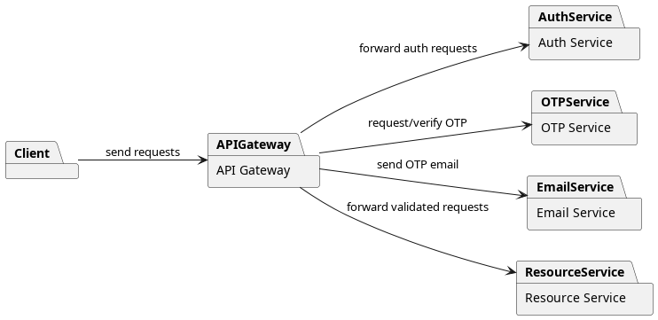

# Auth Micro App

A microservice-based authentication system with separate services for authentication, OTP, email delivery, resource management, and an API gateway. Each service is containerized and communicates over a shared network.

## Architecture

```


```

- **api-gateway**: Handles all client requests, manages sessions, validates JWT tokens, and proxies to other services.
- **auth-service**: Manages user authentication, JWT issuance, and token refresh functionality.
- **resource-service**: Provides CRUD operations for resources with user context extraction.
- **otp-service**: Handles OTP generation/verification, stores OTP sessions in Redis, and logs events.
- **email-service**: Sends OTP emails via SMTP, logs email events, and processes jobs from RabbitMQ.
- **redis**: Shared cache/session store and rate limiter.
- **rabbitmq**: Message queue for email jobs.
- **postgres**: Used by all services for audit/event logging.

## Prerequisites
- Docker & Docker Compose
- (For local dev) Go 1.21+
- SMTP credentials (for email-service)

## Setup (Docker Compose)

1. Clone the repository.
2. Copy and configure each service's `.env` file as needed (see each service directory).
3. Start all services:
   ```bash
   docker-compose up --build
   ```
4. Access services at:
   - API Gateway: `http://localhost:8080`
   - Auth Service: `http://localhost:8083`
   - Resource Service: `http://localhost:8084`
   - OTP Service: `http://localhost:8081`
   - Email Service: `http://localhost:8082`
   - RabbitMQ Dashboard: `http://localhost:15672` (user: admin, pass: adminPassword)
   - Redis: `localhost:6379`
   - PostgreSQL: `localhost:5432`

## Example .env Structure

Each service has its own `.env` file. Example for `auth-service`:
```env
JWT_SECRET="73853"
ACCESS_TOKEN_DURATION=1
REFRESH_TOKEN_DURATION=7
DB_HOST=172.17.0.1
DB_PORT=5432
DB_USER=postgres
DB_PASSWORD=12345678
AUDIT_DB_NAME=audit
USER_DB_NAME=users
DB_SSLMODE=disable
REDIS_HOST=redis
REDIS_PORT=6379
REDIS_PASSWORD=12345678
REDIS_DB=0
APP_ENV=development
Audit_TTL_Days=30
Rate_Limit_Per_Minute=10000
APP_PORT=8083
```

## Troubleshooting
- Ensure all `.env` files are present and correct.
- Check service logs with `docker-compose logs <service>`.
- For SMTP issues, use Gmail App Passwords and enable 2FA.
- For DB/Redis issues, verify credentials and container health.

## Stopping Services
```bash
docker-compose down
```

---